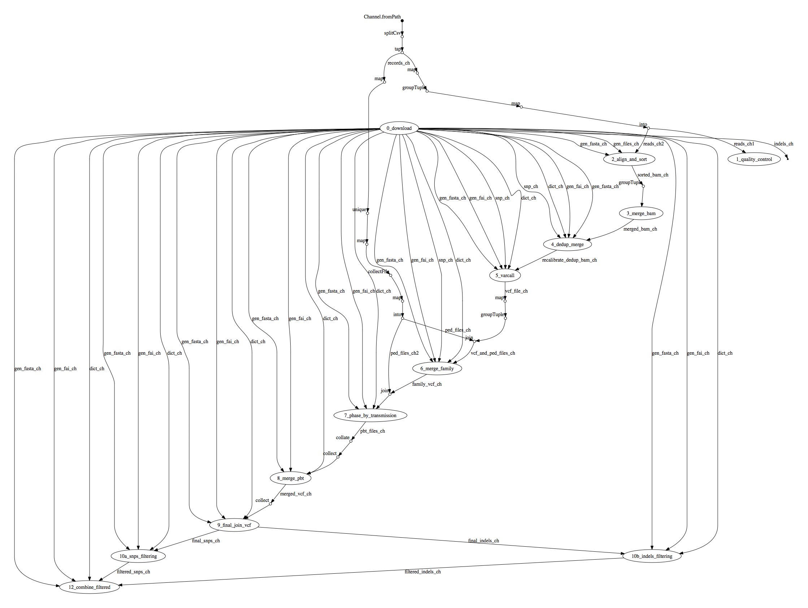

# EOSC pilot project

## Nextflow implementation 

To run the pipeline: 

1. Clone this GitHub repository: 

        git clone https://github.com/CRG-CNAG/EOSC-Pilot.git 

2. Launch the execution with the following command:

        cd EOSC-Pilot
        ./nextflow run main.nf

## GoNL 3.4 implementation 

This version is still under development. Use the following 
command line to launch it: 

        ./nextflow run main-3.4.nf -profile gonl34        
    
Note: this requires nextflow 0.28.0 or higher 

## Execution DAG 

#### Dependencies 

* Java 8 
* Docker 1.10 (or higher)
    

## Original implementation 

To run the pipeline run `perl LaunchPipeline.pl`. This script will:

* download the human genome reference file and index them
* download some ancillary files produced by 1000Genomes Project from the Bundle repository of GATK
* run-encrypt EGA deposited fastq files
* run the script "FromFastqToBam.pl" (this script is run on each pair of fastq files and it is able to perform the various steps to obtain the recalibrated BAM)
* run the script "FromBamToVcf.pl" (this script is run on each sample and firstly the various BAM recalibrated files related to the same individual are merged). 
* Subsequently variant calling is performed

See also https://github.com/molgenis/NGS_DNA/releases
