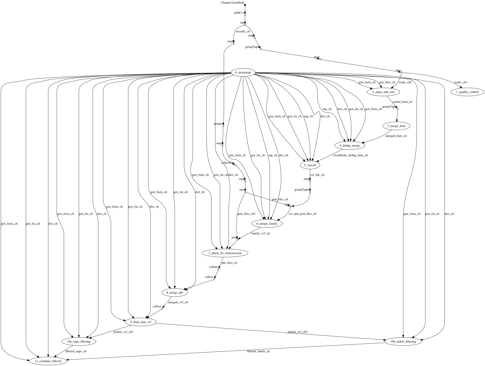

# EOSC pilot project

## Requirements 

* Java 8 (or later) 
* Docker 1.10 (or later)
* GATK 3.7 

Note: This workflow is provided with a Docker with including all
required dependencies except GATK which cannot be distributed due 
to license restrictions. 

## Quickstart  

1. Download the `GenomeAnalysisTK.jar` (version 3.7) package from [this link](https://software.broadinstitute.org/gatk/download/auth?package=GATK-archive&version=3.7-0-gcfedb67), untar and save it in a path in your computer.    

2. Install Nextflow with the following command: 

        curl -s https://get.nextflow.io | bash 

note: you can also install it as a Conda package: 

        conda install nextflow -c bioconda

3. Launch a execution with test data use following command:

        nextflow run CRG-CNAG/EOSC-Pilot --gatk </full/path/to/GenomeAnalysisTK.jar>

## Pipeline parameters 

#### --genref 

Specify the reference genome. Can be either: `test`,`v37` or `v38`. 

For example:

        nextflow run CRG-CNAG/EOSC-Pilot --genref v38

#### --index 

The dataset index file. A tab separated file formatted as shown below: 

```tsv
sample_alias	file_stable_id	archive_ebi_fullpath
gonl-16a	EGAF00000513247	data/test2/fastq/101231_I305_FC810N3ABXX_L7_HUMrutRGVDIAAPE_1.fq.gz
gonl-16a	EGAF00000513248	data/test2/fastq/101231_I305_FC810N3ABXX_L7_HUMrutRGVDIAAPE_2.fq.gz
gonl-16a	EGAF00000513249	data/test2/fastq/110122_I329_FC81DB5ABXX_L6_HUMrutRGVDIAAPE_1.fq.gz
gonl-16a	EGAF00000513250	data/test2/fastq/110122_I329_FC81DB5ABXX_L6_HUMrutRGVDIAAPE_2.fq.gz
gonl-16a	EGAF00000513251	data/test2/fastq/110105_I186_FC812MWABXX_L8_HUMrutRGVDIABPE_1.fq.gz
```

#### --intervals

The *intervals* bed file.

## Execution DAG 



#### Components

This project users the following software packages or libraries 

* R
* Pcard 2.9 
* bwa 0.7.15 
* fastqc 0.11.5 
* sambamba 0.6.6
* Tabix
* GATK 3.7 